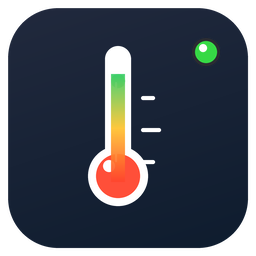

<div align="center">



# 🌡️ GLM 桌面温度计

**一枚钉在桌面右上角的半透明系统监控小部件**

`Rust` · `鼠标穿透` · `0.5% CPU` · `全屏自适应` · `毛玻璃` · `防遮挡避让` · `三级看门狗` · `单实例`

[](https://github.com/sdhack/glm-desktop-thermometer/releases/latest)
[](https://www.rust-lang.org/)
[](https://www.microsoft.com/windows)
[](https://dotnet.microsoft.com/)
[](#-license)

</div>

---

## ✨ 它长这样

```
                    ┌──────────────────────────────────────────────┐
                    │ CPU 8% 62° │ GPU 2% 50° VR 13% │ MEM 50% │ … │   ← 钉在右上角
                    └──────────────────────────────────────────────┘
```

一串半透明的玻璃质感小条，永远浮在屏幕右上角。平时它只是一条数据，**鼠标划过去完全无感**——
不挡按钮、不挡链接、不抢焦点。需要它的时候，按住 `Ctrl` 它就活了。

## 🆚 和它们比

| | GLM 温度计 | RTSS | HWiNFO | 小 taskbar 工具 |
|---|---|---|---|---|
| 内存占用 | **~70MB（三进程合计，含 .NET 桥接，自动修剪）** | ~40MB | ~200MB | ~50MB |
| 鼠标穿透 | ✅ 智能穿透 | ❌ | ❌ | 部分 |
| 压住文字自动挪开 | ✅ 内容识别避让 | ❌ | ❌ | ❌ |
| 全屏视频自动隐藏 | ✅ SMTC + 几何判定 | ❌ | ❌ | ❌ |
| 无托盘图标 | ✅ | ❌ | ❌ | ❌ |
| 进程级自愈 | ✅ 三级看门狗 + Job 干净回收 | ❌ | ❌ | ❌ |
| 单实例保护 | ✅ 命名互斥体 | 部分 | 部分 | 部分 |
| 安装体积 | **< 5MB** | ~30MB | ~100MB | ~20MB |

## 📊 监控数据

| 段位 | 数据 | 数据源 |
|---|---|---|
| `CPU` | 占用率 + 温度 | PDH + LibreHardwareMonitor 桥接 |
| `GPU` | 核心占用 + **温度** + 显存占用 | NVIDIA NVML / NVAPI / PDH / DXGI |
| `MEM` | 内存占用率 | GlobalMemoryStatusEx |
| `DISK` | NVMe / SATA 温度（最多 2 盘） | 存储 IOCTL 直读，失败回退 PowerShell |
| `FAN` | 风扇转速 ×3（主板/显卡） | SuperIO / NVML |

> 某项数据读不到时**整段自动隐藏**，绝不显示占位符；数据源卡住超过 10 秒，
> 旧值作废隐藏，绝不显示冻结的数字。

## 🎨 两种形态

<table>
<tr><th>完整条 · 24px</th><th>小胶囊 · 24px</th></tr>
<tr><td>

```
┌─────────────────────────────────────────────────┐
│ CPU 8% 62° │ GPU 2% 50° VR 13% │ MEM 50% │ … │
└─────────────────────────────────────────────────┘
```
单行显示全部段位，**等宽槽位右对齐**——数字从 2% 跳到 100% 也不会推挤相邻段。

</td><td>

```
      ┌──────────────┐      ┌──────────────┐
      │ ● CPU 8% 62° │  →   │ ● GPU 2% 50° │  →  …
      └──────────────┘      └──────────────┘
```
按硬件**分组轮播**（1-5 秒可调，滚轮直接翻），左上角几何色点
实时反映系统健康（负载+温度四档：🟢🟡🟠🔴）。

</td></tr>
</table>

## 🧠 显隐策略（举一反三）

| 场景 | 表现 |
|---|---|
| 桌面 / 任意窗口 | ✅ 置顶常显，鼠标穿透 |
| 全屏**游戏** | ✅ 照常显示（你正需要它的时候） |
| 全屏**看视频** | 🙈 自动隐藏（SMTC 媒体会话 + 几何判定，视频暂停即恢复） |
| 其他置顶窗口出现 | ⚡ 前台钩子即时夺回置顶 |
| Ctrl 按下 | 🔓 解除穿透进入编辑态（拖拽 / 菜单 / 滚轮翻页） |

## 🕶️ 防遮挡自动避让

别的小部件要么永远被窗口压着，要么傻傻地每秒截屏轮询。GLM 温度计的做法：

- **事件驱动 + 兜底巡检**：全局钩子监听其他窗口的移动 / 显示 / 隐藏 / 前台切换，
  300ms 节流合并事件风暴，事件落在节流窗口内会安排精确重试定时器——
  任何窗口变化 **0.3~1 秒内**完成检测；完全不产生窗口事件的场景
  （后台窗口加载内容等）由 **2.5 秒兜底巡检**覆盖，静止时依旧近乎零开销
- **会认字**：对温度计下方的屏幕区域做边缘 + 色度分析，能分清「文字 / 图标」和
  「壁纸 / 渐变」——压住任务栏文字、浏览器标签、桌面图标都会自动挪走
- **激活/非激活一视同仁**：检测基于屏幕内容而非窗口焦点，后台窗口盖上来照样躲
- **按最宽形态预留**：胶囊翻页会变宽？避让按所有翻页中的最大宽度计算占位，
  窄时不挡、翻到宽页也不挡
- **三级选位**：优先右移 → 左侧 → 都没空位则移动到**遮挡最少**的位置，
  配合粘性记忆 + 密度阈值，收敛到最优点后稳定驻留、绝不乒乓
- **检测自己不可见**：`WDA_EXCLUDEFROMCAPTURE` 把自己从截图中排除，
  截屏在定时器回调中执行——**UI 线程零阻塞**，鼠标丝般顺滑
- **贴边自适应**：靠近屏幕右缘放不下时，自动截掉尾部项目**优先显示左侧核心数据**，
  并整体夹回屏幕内，绝不露出屏幕外

菜单中可随时**关闭**这套机制（默认开启）。

## 🚀 快速开始

### 直接运行

```
tempmon.exe        # 双击即用，无安装、无弹窗、无托盘
```

### 从源码构建

```bash
# 依赖：Rust (MSVC) + .NET 8 SDK
git clone https://github.com/sdhack/glm-desktop-thermometer.git
cd glm-desktop-thermometer

cargo build --release                                    # 主程序
cd lhm-bridge && dotnet publish -c Release               # CPU 温度/风扇桥接
cp bin/Release/net8.0/win-x64/publish/* ../../target/release/
```

### 开机自启

`Ctrl + 右键` → 勾选 **开机自启**（写入当前用户注册表 Run 键，无需管理员权限，可随时关闭）。

## 🏗️ 架构

```
┌─────────────────────────────────────────────────────────────┐
│                     tempmon.exe (UI)                        │
│  置顶分层窗口 · D2D 渲染 · 显隐策略 · 菜单 · 钩子 · 三级看门狗    │
└───────────────┬─────────────────────────────────────────────┘
                │ 共享内存（零拷贝）+ 时间基心跳看门狗
┌───────────────▼─────────────────────────────────────────────┐
│                  tempmon.exe (sensor)                       │
│   CPU/GPU/内存 (PDH) · GPU 温度 (NVML/NVAPI) · 显存 (DXGI)     │
│        Job 对象：全部孙进程挂管，退出即回收                      │
└──────┬───────────────────────┬──────────────────────────────┘
       │ stdout                │ 存储栈 IOCTL（失败回退 PowerShell，60s）
┌──────▼──────────┐   ┌────────▼─────────┐
│  lhm-bridge.exe │   │  硬盘温度          │
│  CPU 温度·风扇   │   └──────────────────┘
│ (LibreHard…Lib) │
└─────────────────┘
```

**三级崩溃自愈**：任何一级进程退出，上一级自动拉起（连续失败按倍数退避，绝不无限重拉）；
看门狗按**真实时间**判定帧停滞——避让动画的高频刷新不会误杀采集进程。
所有子进程挂在 `KILL_ON_JOB_CLOSE` 作业对象下：主进程无论正常退出还是被杀，
全部子孙进程干净回收，**绝不留后台孤儿进程**。

## ⚙️ 技术亮点

- **等宽槽位渲染**：每个数值按 `100%`/`100°` 预留槽宽右对齐——从 2% 跳到 100% 相邻段纹丝不动
- **智能穿透**：默认 `WS_EX_TRANSPARENT` 整窗穿透；`WH_KEYBOARD_LL` 低级钩子让 Ctrl 按下瞬间解除，无需轮询
- **单实例**：命名互斥体，双开自动退出——两个小部件打架、共享内存竞写？不存在
- **点击 vs 拖拽判定**：记录按下坐标，位移 <6px 才算点击——拖完位置不会误触发展开
- **防抖显示**：数据源短暂消失时沿用旧值 15 秒，段位不闪现闪没
- **数据防冻结**：桥接缓存带 TTL，数据源 hang 死时隐藏温度段而不是显示旧值
- **系统级毛玻璃**：`SetWindowCompositionAttribute` 亚克力（未公开 API 动态解析，自动降级）
- **零拷贝 IPC**：共享内存帧 + u32 位模式序号心跳（f32 槽位存不了大整数？位运算绕过），
  读侧序号前后比对丢弃撕裂帧，无序列化开销
- **15 分钟色点**：负载（CPU/GPU/内存最大值）+ 温度四档综合判定，阈值按整机状态校准
- **事件驱动避让**：WinEvent 全局钩子 + 300ms 节流 + 精确重试定时器 + 2.5s 兜底巡检，
  检测全程不阻塞 UI 线程；`WDA_EXCLUDEFROMCAPTURE` 让自己在截图中隐身
- **边缘 + 色度内容识别**：梯度边缘（文字/图标轮廓）∪ 高色差像素（彩色图标），
  一张内容图全行复用，40px 细扫描 37 个候选位几乎零成本
- **圆角双方案**：毛玻璃走 DWM 系统圆角（雾面层不吃区域裁剪），
  普通模式走 `SetWindowRgn` 区域裁剪（天然无投影），Win10 自动回退
- **看门狗时间基 + 退避**：帧停滞按真实时间判定（8 秒），连续失败指数退避（最长 96 秒）——
  环境性故障不会引发进程重生风暴
- **周期性工作集修剪**：三进程每 10 分钟 `SetProcessWorkingSetSize` 换出冷页，
  桥接启动即修剪 + 工作站非并发 GC——常驻占用减半

## ⚙️ 全部可配置

<details>
<summary><b>展开菜单结构</b></summary>

```
收起为小胶囊 / 展开为完整条     ← 标签随状态变化
──────────────────────────
外观 ▸    背景颜色（深色 / 浅色 / 深色毛玻璃 / 浅色毛玻璃）
          透明度（25% / 50% / 70% / 90%）
──────────────────────────
显示内容 ▸   CPU 段 / GPU 段 / 内存段 / 硬盘段 / 风扇段
胶囊显示项 ▸  最高温度 / CPU 占用 / CPU 温度 / GPU 占用 / GPU 温度
            显存占用 / 内存占用 / 硬盘温度 / 风扇转速
──────────────────────────
轮播间隔 ▸   1 秒 / 2 秒 / 3 秒 / 5 秒
刷新频率 ▸   500 毫秒 / 1 秒 / 2 秒
防遮挡检测 ▸  开启 / 关闭（压到文字图标自动挪开）
──────────────────────────
开机自启
恢复吸附右上角
──────────────────────────
退出
```

</details>

配置文件 `%APPDATA%\tempmon.conf`，即改即存、重启恢复。

## 📋 更新日志

<details>
<summary><b>v1.2.0 · 稳定性大版本</b></summary>

**修复**
- 🩹 **避让误杀采集进程**（总根源）：避让动画每 16ms 手动刷新一次界面，旧版按
  "tick 计数"判卡死，一次避让必然触发 6 次计数 → 误杀 sensor → 重拉 → 每次泄漏
  一个 80MB 孤儿桥接进程（用户实测堆积 29 个、2GB+ 内存）。改为按真实时间判定。
- 🩹 桥接进程挂入 `KILL_ON_JOB_CLOSE` 作业对象：sensor 重启/退出时桥接随之回收
- 🩹 恢复吸附右上角后重启会钉在屏幕左上角（配置持久化 0,0 歧义）
- 🩹 采集序号用 f32 存储，2²⁴ 帧后停止递增引发看门狗误判（改 u32 位模式）
- 🩹 菜单改刷新频率对采集侧不生效（配置键名不一致）
- 🩹 恢复吸附、非激活窗口变化不避让（新增 2.5s 兜底巡检）

**新增**
- ✅ 单实例保护（命名互斥体）
- ✅ 传感器重拉指数退避（6s→96s），环境性故障不再进程风暴
- ✅ 桥接数据 10 秒 TTL，数据源卡死自动隐藏而非冻结显示
- ✅ 硬盘温度原生 IOCTL 直读（PowerShell 自动回退）
- ✅ 开机自启迁移注册表 Run 键（无需管理员权限）

</details>

<details>
<summary><b>v1.0.0 ~ v1.1.2</b></summary>

- v1.1.x：防遮挡自动避让系统（事件驱动 + 内容识别 + 三级选位）、边缘图标漏检修复
- v1.0.0：首个正式版——双形态、毛玻璃、全屏自适应、三级看门狗、等宽槽位渲染

</details>

## ❓ FAQ

<details>
<summary><b>CPU 温度显示不了？</b></summary>

CPU 温度来自 LibreHardwareMonitor 内核驱动，部分杀软（360 等）可能拦截。
若温度段消失，检查 lhm-bridge 是否被拦截并添加信任。
</details>

<details>
<summary><b>进程内存怎么算？</b></summary>

三进程工作集约 70MB：UI 界面 ~7MB、采集子进程 ~30MB、
桥接进程 ~30MB（.NET 运行时 + LibreHardwareMonitorLib 是大头）。
主程序本体只有 200KB——大头都是生态库。所有进程挂 Job 对象管理，退出即全部回收，
且每 10 分钟自动修剪工作集，占用常年保持低位；绝不会像某些工具一样在后台悄悄堆积。
</details>

<details>
<summary><b>为什么不用 PresentMon 显示 FPS？</b></summary>

尝试过：PresentMon 1.10 的 CSV 输出在运行期完全不 flush（管道和文件都是
退出时才写），无法流式读取实时数据。详见 [开发记录](开发记录.md) 踩坑 #3。
</details>

<details>
<summary><b>GPU 数据偶尔消失？</b></summary>

GPU 空闲时 Windows 会注销 PDH 计数器实例。已内置 15 秒防抖沿用旧值，
持续空闲超时后整段隐藏，恢复负载后自动回来。
</details>

## 📁 项目结构

```
├─ crates/
│  ├─ tempmon-ui/       # UI：窗口/渲染/策略/菜单/钩子/看门狗
│  └─ tempmon-sensor/   # 采集：PDH/DXGI/NVML/共享内存协议
├─ lhm-bridge/          # CPU 温度+风扇桥接（C# / LibreHardwareMonitorLib）
├─ tools/               # 诊断脚本（避让检测 / 盘温验证）
├─ 方案.md              # 技术方案（架构/选型/风险/里程碑）
└─ 开发记录.md          # 开发日志 + 踩坑记录
```

---

<div align="center">

**如果对你有帮助，点个 ⭐ 再走**

用 Rust 写的，主程序编译出来就 200KB——这才是 Windows 小工具该有的样子。

</div>
